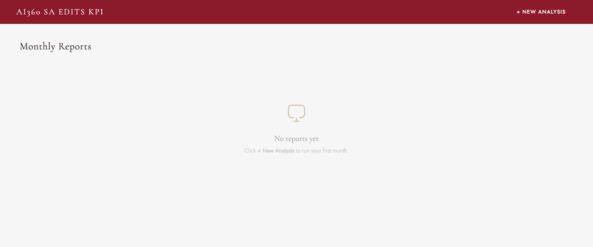

# SA Edit vs Original — KPI Analysis



A browser-based dashboard that measures how Sales Associates edit AI-generated outreach messages in the AI360 system. No install, no server — open `index.html` and everything runs locally in your browser.

**[▶ Watch the demo](https://www.loom.com/share/75651eae16c9462b9fe4a243be0eea85)**

---

## Run an analysis

1. Open `index.html` in Chrome or Edge
2. Click **+ New Analysis**, drop in your raw `.xlsx` export, and pick the month
3. Click **Run Analysis** — the tool filters, translates, diffs, and computes KPIs, then opens the dashboard

The report is saved to your browser and appears on the home screen. Click any month to reload it instantly.

---

## What the dashboard shows

Four tabs (Overall, Emotional Bonding, Task, Product Storytelling), a headline banner (messages generated, edited, edit rate, # of SAs), and five KPI sections:

1. **Edit Rate** — share of AI messages the SAs edited
2. **Location of Change** — opening / middle / closing
3. **Length Change** — shortened vs expanded
4. **Content Type** — greeting, CTA, product refs, emoji, etc.
5. **SA Distribution** — how edit rates spread across individual SAs

Click **Show evidence** on any row to see the underlying messages, with removed text in red and added text in green. Exact thresholds are in [KPI_REFERENCE.md](documentation/KPI_REFERENCE.md).

**Downloads:** translated rows, colour-diffed rows, and the full `KPI_Summary.xlsx`.

> All data stays in your browser (`localStorage`). Nothing is uploaded — translation (Step 2) is the only step that touches the network.

---

## Input file

A raw `.xlsx` export with a `Sheet1`. Each row is one AI-generated message; the key column is `copy_to_chat_history`, whose JSON records whether the SA edited the message before sending:

```json
{ "latest_version": "v1",
  "v1": { "is_change": true,
          "send_time": "2024-11-15T10:32:00+08:00",
          "send_content": "The message the SA actually sent" } }
```

Only rows with `is_change: true` are analysed. Other useful columns: `seller_id`, `unify_id`, `use_case`, `conversation_starter_subject`, `conversation_starter_message`.

---

## Optional: Python pipeline

Prefer Excel output over the browser? Run the same analysis locally:

```bash
pip install -r python_pipeline/requirements.txt
```

Then, from `python_pipeline/`, run in order: `translate_export.py` → `enrich_diffs.py` → `rebuild_xlsx.py` → `add_kpi_panel.py`. All KPI thresholds live in `add_kpi_panel.py`.
